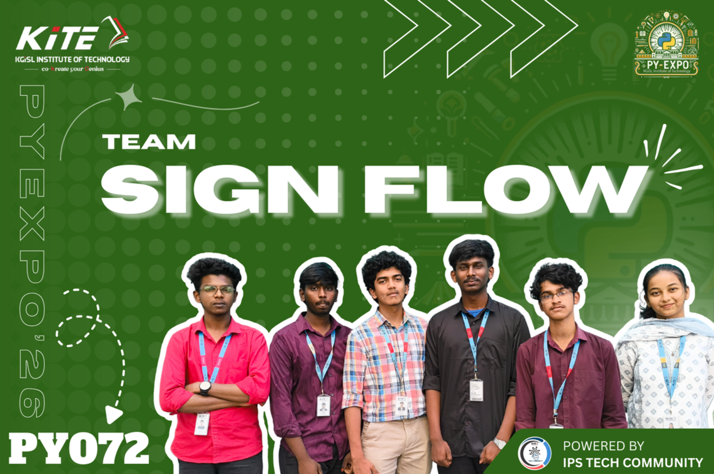

# SignFlow

SignFlow is a sign-language-to-text system built around real-time landmark extraction, sequence modeling, remote inference, and caption delivery through an overlay and web interface.


---

## Overview

The project is organized as a pipeline:

1. Capture visual input from a webcam, screen region, or live source.
2. Extract hand and pose landmarks with MediaPipe.
3. Convert landmark sequences into model-ready tensors.
4. Run sign recognition through a Transformer-based inference stack.
5. Post-process predictions into readable text.
6. Render captions in an always-on-top desktop overlay or surface them through the web app.

This separation keeps capture, inference, UI, and deployment concerns modular.

---

## Technical Flow

### 1. Input Acquisition

The overlay layer acquires frames from the local device and prepares them for downstream processing. Depending on the execution mode, SignFlow can work with direct webcam input or a remote inference setup where the desktop client only handles capture and presentation.

### 2. Landmark Extraction

MediaPipe is used to detect hand landmarks and related motion features from each frame. These landmarks are more compact and stable than raw pixels, which makes them a practical representation for real-time sign recognition.

### 3. Sequence Construction

Detected landmarks are accumulated into temporal windows so the model can reason about motion over time instead of isolated poses. This is important because many signs depend on movement direction, speed, and frame-to-frame continuity.

### 4. Model Inference

The model stack uses a Transformer-based recognizer to classify sign sequences into text labels. In local workflows this can run directly from the model code, while in deployment-oriented workflows the overlay can send data to a remote inference server and receive predicted text back.

### 5. Text Post-Processing

Predictions can be cleaned, corrected, or enhanced before presentation. This stage is where sentence smoothing, grammar assistance, or optional LLM-based refinement can be integrated.

### 6. Output Delivery

The recognized text is surfaced through two main interfaces:

- A desktop overlay for real-time caption display
- A Flask web application for product pages, downloads, and service integration

---

## System Architecture

```text
Camera / Live Input
        |
        v
MediaPipe Landmark Extraction
        |
        v
Sequence Builder
        |
        v
Transformer Inference
        |
        v
Text Post-Processing
        |
        +--> Desktop Overlay (PyQt5)
        |
        +--> Web / Service Layer (Flask)
```

---

## Repository Structure

```text
Code/
|-- Common/
|   |-- Overlay/                # Desktop overlay, packaging, installer flow
|   `-- Models/                 # Shared model assets such as MediaPipe task files
|-- Model/                      # Training, inference, and model-serving code
|-- Website-LandingPage/        # Flask site, auth flow, downloads, static assets
`-- ...

Docs/                           # SOP, demo assets, project media
```

The exact folders may evolve, but the repo is generally split into:

- `Model`: training and inference logic
- `Common/Overlay`: desktop client and Windows packaging
- `Website-LandingPage`: public-facing web application
- `Docs`: supporting documents and media

---

## Core Components

### Model Layer

Contains training, inference, dataset handling, model weights, and server-side prediction logic. This is the computational core of the project.

### Overlay Layer

Contains the caption UI, capture logic, runtime configuration, and packaged Windows distribution flow. The recent setup process builds this as a desktop app named `SignFlow`.

### Web Layer

Contains the Flask app that powers the landing page, authentication, demo pages, and platform-specific download routes.

---

## Tech Stack

| Layer | Technology |
|-------|------------|
| Capture / CV | OpenCV, MediaPipe |
| Recognition | PyTorch, Transformer models |
| Desktop UI | PyQt5 |
| Web App | Flask |
| Packaging | PyInstaller, Inno Setup |
| Optional Text Refinement | LLM-assisted post-processing |

---

## Local Setup

```bash
git clone https://github.com/mano-dev-01/SignFlow.git
cd SignFlow
python -m venv venv
```

Activate the environment:

```bash
# Windows
venv\Scripts\activate

# macOS / Linux
source venv/bin/activate
```

Install project dependencies according to the component you want to run. Different folders may maintain their own requirements files.

---

## Running The Project

### Model / Inference

Run the model entry points from the model module you are working with.

```bash
cd Code/Model
python sign_inference.py
```

### Overlay

Run the desktop overlay from the overlay module during development.

```bash
cd Code/Common/Overlay
python -m signflow_overlay
```

### Website

Run the Flask site locally:

```bash
cd Code/Website-LandingPage
python main.py
```

Then open `http://localhost:5000`.

---

## Windows Packaging Flow

The Windows desktop distribution is built in two stages:

1. PyInstaller generates the packaged `SignFlow` application.
2. Inno Setup wraps that packaged app into `SignFlowSetup.exe`.

This approach keeps the runtime portable for end users while preserving a normal installer experience with shortcuts and uninstall support.

---

## Deployment Notes

- The Flask site handles download routing for platform-specific installers.
- The Windows installer can be hosted as a GitHub Release asset.
- The overlay can be configured to talk to a remote inference server through runtime configuration or environment variables.

---

## Documentation

<table>
<tr>
<td align="center">
<a href="Docs/SignFlow_SOP%20_PY072.pdf">

<br/>Standard Operating Procedure
</a>
</td>
<td align="center">
<a href="Docs/Signflow(%20demo).mp4">

<br/>Watch Demo
</a>
</td>
</tr>
</table>
